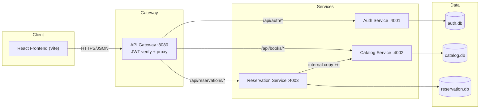
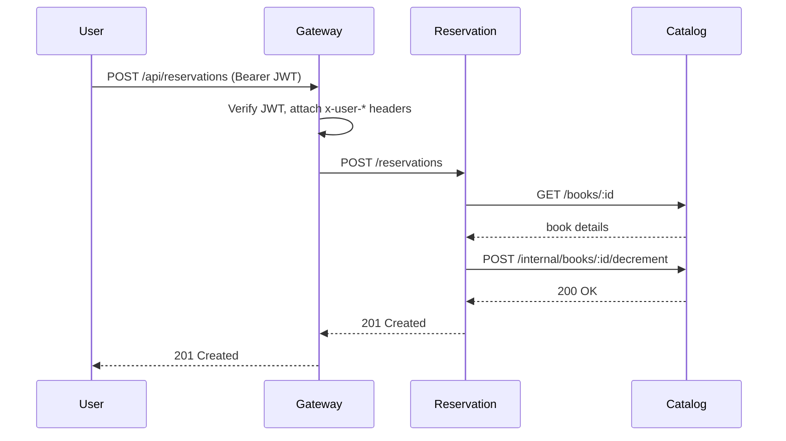

# Architecture Diagram

```mermaid
flowchart LR
  subgraph Client
    UI["React Frontend (Vite)"]
  end

  subgraph Gateway
    GW["API Gateway :8080<br/>JWT verify + proxy"]
  end

  subgraph Services
    AUTH["Auth Service :4001"]
    CAT["Catalog Service :4002"]
    RES["Reservation Service :4003"]
  end

  subgraph Data
    AUTHDB[("auth.db")]
    CATDB[("catalog.db")]
    RESDB[("reservation.db")]
  end

  UI -- "HTTPS/JSON" --> GW
  GW -- "/api/auth/*" --> AUTH
  GW -- "/api/books/*" --> CAT
  GW -- "/api/reservations/*" --> RES
  RES -- "internal copy +/-" --> CAT

  AUTH --> AUTHDB
  CAT --> CATDB
  RES --> RESDB
```

## Request Flow: Create Reservation

```mermaid
sequenceDiagram
  participant U as User
  participant G as Gateway
  participant R as Reservation
  participant C as Catalog

  U->>G: POST /api/reservations (Bearer JWT)
  G->>G: Verify JWT, attach x-user-* headers
  G->>R: POST /reservations
  R->>C: GET /books/:id
  C-->>R: book details
  R->>C: POST /internal/books/:id/decrement
  C-->>R: 200 OK
  R-->>G: 201 Created
  G-->>U: 201 Created
```
