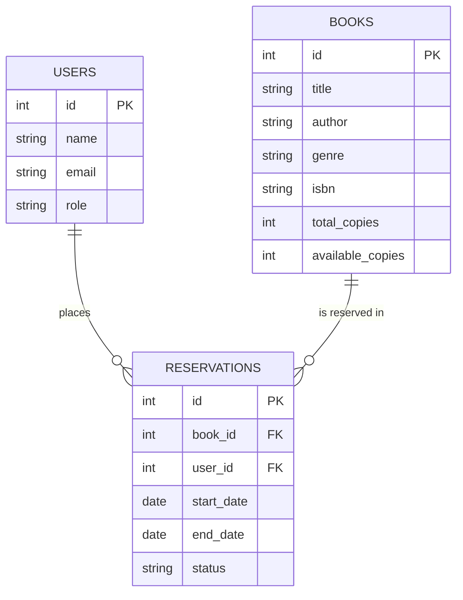

# Database Schema

## auth.db — `users`
| Column        | Type      | Notes                                  |
|---------------|-----------|----------------------------------------|
| id            | INTEGER   | PK, AUTOINCREMENT                      |
| name          | TEXT      | NOT NULL                               |
| email         | TEXT      | UNIQUE, NOT NULL                       |
| password_hash | TEXT      | NOT NULL (bcrypt)                      |
| role          | TEXT      | CHECK: student / staff / admin         |
| created_at    | DATETIME  | DEFAULT CURRENT_TIMESTAMP              |

## catalog.db — `books`
| Column           | Type     | Notes                          |
|------------------|----------|--------------------------------|
| id               | INTEGER  | PK, AUTOINCREMENT              |
| title            | TEXT     | NOT NULL                       |
| author           | TEXT     | NOT NULL                       |
| genre            | TEXT     | NOT NULL                       |
| isbn             | TEXT     | UNIQUE                         |
| total_copies     | INTEGER  | NOT NULL DEFAULT 1             |
| available_copies | INTEGER  | NOT NULL DEFAULT 1             |
| summary          | TEXT     |                                |
| created_at       | DATETIME | DEFAULT CURRENT_TIMESTAMP      |

## reservation.db — `reservations`
| Column      | Type     | Notes                                                          |
|-------------|----------|----------------------------------------------------------------|
| id          | INTEGER  | PK, AUTOINCREMENT                                              |
| book_id     | INTEGER  | references catalog.books.id (cross-service, no FK constraint)  |
| book_title  | TEXT     | denormalized snapshot                                          |
| user_id     | INTEGER  | references auth.users.id                                       |
| user_name   | TEXT     | denormalized snapshot                                          |
| user_role   | TEXT     | snapshot of role at request time                               |
| start_date  | TEXT     | ISO date                                                       |
| end_date    | TEXT     | ISO date                                                       |
| status      | TEXT     | CHECK: requested / approved / rejected / returned              |
| created_at  | DATETIME | DEFAULT CURRENT_TIMESTAMP                                      |
| updated_at  | DATETIME | DEFAULT CURRENT_TIMESTAMP                                      |

## ER Diagram (logical)

